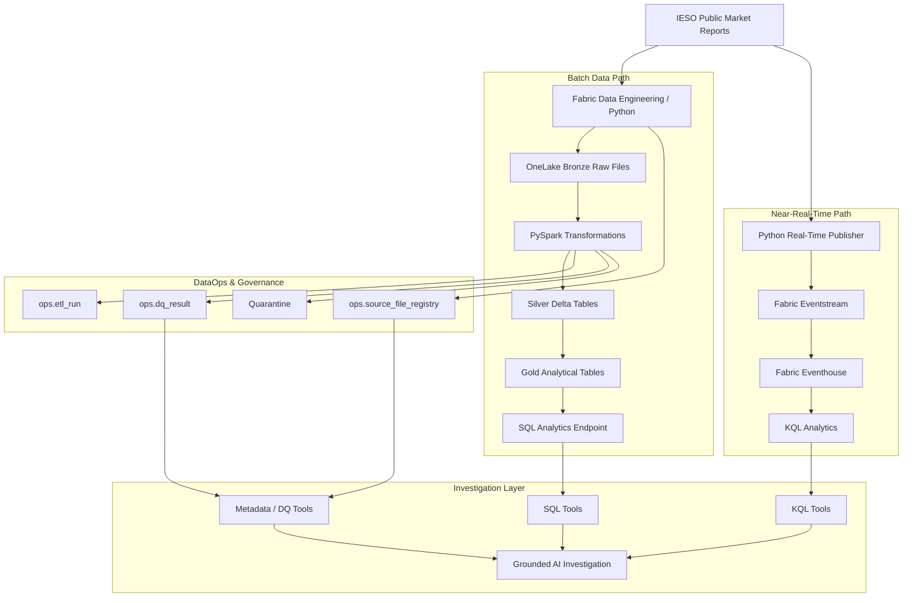
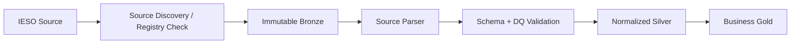
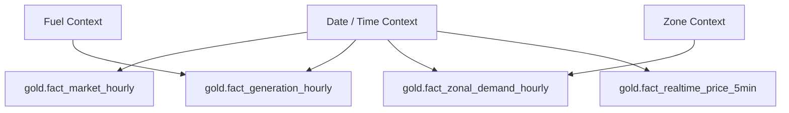
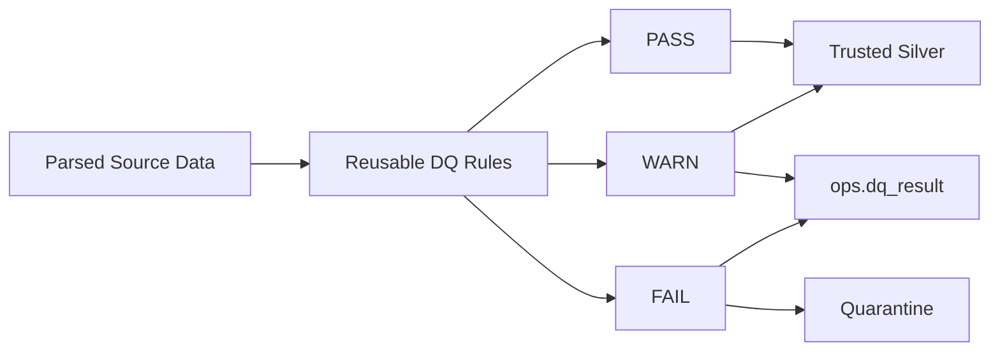
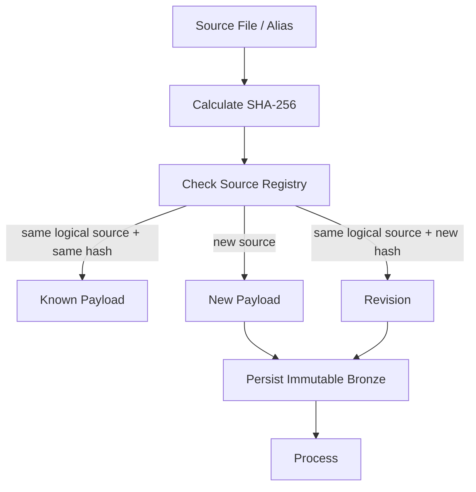
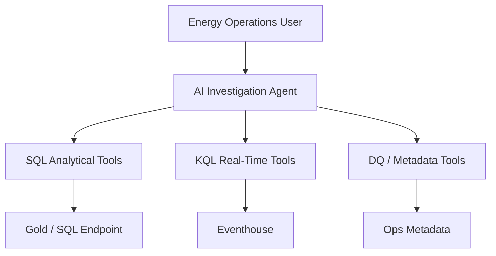

# GridPulse AI — Architecture V1

**Project:** GridPulse AI — Ontario Real-Time Energy Intelligence & DataOps Platform  
**Architecture version:** 1.0  
**Status:** MVP architecture baseline  
**Last reviewed:** 2026-08-25

---

## 1. Architecture Objective

GridPulse AI is designed as a production-oriented data platform for Ontario electricity-market intelligence.

The architecture must support:

- batch ingestion;
- near-real-time ingestion;
- immutable raw-data preservation;
- source revision handling;
- normalized trusted datasets;
- reusable data-quality controls;
- operational observability;
- multiple analytical grains;
- SQL and KQL serving;
- grounded AI-assisted investigation;
- reproducible development and version control.

The architecture prioritizes:

```text
correctness
→ reproducibility
→ maintainability
→ observability
→ performance optimization
```

rather than introducing platform features without a demonstrated requirement.

---

## 2. High-Level Architecture



---

## 3. Current Fabric Topology

### Workspace

```text
ws-gridpulse-dev
```

Purpose:

```text
development
source discovery
data engineering
quality validation
real-time development
```

---

### Lakehouse

```text
lh_gridpulse
```

The MVP uses one schema-enabled Lakehouse.

Logical structure:

```text
lh_gridpulse
│
├── Files/
│   └── bronze/
│       └── ieso/
│           ├── demand/
│           ├── demand_zonal/
│           ├── generation/
│           ├── price_day_ahead/
│           └── price_realtime/
│
├── silver.*
├── gold.*
└── ops.*
```

The decision to use one Lakehouse is documented in:

```text
ADR-005
```

Physical separation into multiple Lakehouses is intentionally deferred until a concrete governance, ownership, security, or workload requirement justifies it.

---

# 4. Source Layer

GridPulse currently integrates five official IESO source domains.

```text
SRC-001
Hourly Demand

SRC-002
Hourly Zonal Demand

SRC-003
Generator Output by Fuel Type Hourly

SRC-004
Day-Ahead Ontario Zonal Price

SRC-005
Real-Time Ontario Zonal Price
```

Detailed source behaviour is documented in:

```text
docs/source_catalog.md
```

Formal expectations are documented in:

```text
docs/data_contracts.md
```

---

# 5. Batch Architecture

## 5.1 Batch Flow



The target engineering flow is:

```text
discover source
→ identify payload
→ preserve raw bytes
→ register lineage
→ parse
→ validate
→ normalize
→ apply DQ
→ publish trusted Silver
→ build Gold
```

---

## 5.2 Bronze Responsibilities

Bronze stores original source payloads.

Responsibilities:

- immutable raw preservation;
- payload hashing;
- source revision retention;
- replay capability;
- forensic evidence.

Bronze does not perform:

- business imputation;
- source-value correction;
- analytical aggregation;
- source reconciliation overwrites.

---

## 5.3 Silver Responsibilities

Silver provides trusted normalized datasets.

Planned Silver tables:

```text
silver.demand_hourly
silver.demand_zonal_hourly
silver.generation_hourly
silver.price_day_ahead_hourly
silver.price_realtime_5min
```

Silver responsibilities include:

```text
schema enforcement
type normalization
column normalization
grain enforcement
source metadata
null preservation
validation
controlled wide-to-long transformations
```

---

# 6. Silver Data Model

## 6.1 Hourly Demand

Target:

```text
silver.demand_hourly
```

Grain:

```text
market_date + hour_ending
```

Primary measures:

```text
market_demand_mw
ontario_demand_mw
```

---

## 6.2 Zonal Demand

Target:

```text
silver.demand_zonal_hourly
```

Grain:

```text
market_date + hour_ending + zone
```

The physical IESO report is wide.

Silver performs:

```text
wide source representation
→
normalized long representation
```

Aggregate source fields such as:

```text
Ontario Demand
Zone Total
Diff
```

are not duplicated into every zone-grain record.

---

## 6.3 Generation

Target:

```text
silver.generation_hourly
```

Grain:

```text
market_date + hour_ending + fuel_type
```

Primary fields:

```text
output_mwh
output_quality_code
```

Source-reported categories remain dynamic.

GridPulse does not hard-code a fixed list of fuel categories.

---

## 6.4 Day-Ahead Price

Target:

```text
silver.price_day_ahead_hourly
```

Grain:

```text
market_date + hour_ending
```

Primary measures:

```text
zonal_price_cad_per_mwh
loss_price_capped_cad_per_mwh
congestion_price_capped_cad_per_mwh
```

---

## 6.5 Real-Time Price

Target:

```text
silver.price_realtime_5min
```

Grain:

```text
delivery_date
+ delivery_hour
+ interval
```

Primary measures:

```text
zonal_price_capped_cad_per_mwh
loss_price_capped_cad_per_mwh
congestion_price_capped_cad_per_mwh
```

The source may expose interval slots before prices are populated.

Those states are preserved rather than automatically converted into zero.

---

# 7. Gold Analytical Architecture

GridPulse deliberately avoids a single denormalized mega-table.

The planned analytical model is:



---

## 7.1 Market Hourly Fact

```text
gold.fact_market_hourly
```

Expected grain:

```text
market_date + hour_ending
```

Expected use:

- Ontario Demand;
- Market Demand;
- Day-Ahead price;
- trusted hourly market KPIs.

---

## 7.2 Generation Fact

```text
gold.fact_generation_hourly
```

Grain:

```text
market_date + hour_ending + fuel_type
```

---

## 7.3 Zonal Demand Fact

```text
gold.fact_zonal_demand_hourly
```

Grain:

```text
market_date + hour_ending + zone
```

---

## 7.4 Real-Time Price Fact

```text
gold.fact_realtime_price_5min
```

Grain:

```text
delivery_date + delivery_hour + interval
```

The five-minute grain remains available even when an hourly comparison measure is later derived.

---

# 8. Grain Isolation

Native grains must remain explicit.

```text
Demand
date + hour

Day-Ahead
date + hour

Generation
date + hour + fuel

Zonal Demand
date + hour + zone

Real-Time
date + hour + interval
```

For example, directly joining:

```text
10 zones
×
8 generation categories
×
12 RT intervals
```

could create:

```text
960 rows
```

for what originated as one hourly market context.

Therefore, cross-domain metrics must be aggregated or queried deliberately.

This decision is documented in:

```text
ADR-004
```

---

# 9. Operational Architecture

GridPulse treats pipeline execution and data trust as separate operational dimensions.

Planned operational tables:

```text
ops.etl_run
ops.source_file_registry
ops.dq_result
```

---

## 9.1 Source File Registry

Target:

```text
ops.source_file_registry
```

Purpose:

- source discovery history;
- idempotency;
- revision detection;
- lineage;
- troubleshooting.

Expected metadata includes:

```text
source_name
source_url
source_file
source_version
file_size
source_hash
source_created_at
first_seen_timestamp
last_seen_timestamp
processing_status
run_id
```

---

## 9.2 ETL Run Control

Target:

```text
ops.etl_run
```

Purpose:

- execution tracking;
- failure diagnosis;
- operational metrics.

Expected fields include:

```text
run_id
pipeline_name
source_name
start_timestamp
end_timestamp
status
records_read
records_written
records_rejected
error_message
```

---

## 9.3 Data Quality Results

Target:

```text
ops.dq_result
```

Purpose:

- contract validation;
- data trust evidence;
- operational investigation.

DQ outcome model:

```text
PASS
WARN
FAIL
```

Pipeline execution success and data-quality success are separate concepts.

---

# 10. Data Quality Architecture



This diagram is conceptual.

Individual rules may stop dataset processing rather than quarantine individual records when record-level isolation is unsafe.

---

# 11. Quarantine Boundary

Quarantine is reserved for records that cannot safely satisfy a Silver structural contract.

Examples:

```text
unparseable required business key
invalid required numeric field
unrecoverable schema violation
duplicate grain key inside one authoritative payload
```

Conditions that normally remain outside quarantine include:

```text
negative electricity price
source-permitted null
cross-source disagreement
valid new category
latest-period incompleteness
legitimate source revision
```

This distinction prevents data-quality logic from silently removing valid but unusual market behaviour.

---

# 12. Revision-Aware Architecture

IESO sources may be revised.

The architecture therefore distinguishes:

```text
logical source identity
```

from:

```text
physical payload identity
```

Conceptually:



The exact processing implementation will be built during Bronze/Silver engineering.

---

# 13. Near-Real-Time Architecture

The Real-Time Ontario Zonal Price source is handled through a separate low-latency path.


---

## 13.1 Source Characteristics

Business key:

```text
delivery_date
+ delivery_hour
+ interval
```

Source report behaviour:

```text
12 five-minute slots
```

The mutable current alias changes as the dispatch hour progresses.

---

## 13.2 Event Eligibility

Bronze preserves the complete source snapshot.

The planned event publisher emits only sufficiently populated price observations.

Conceptually:

```text
fully populated interval
→ eligible event

fully empty interval
→ preserve source state
→ no market-price event yet
```

This is a GridPulse operational rule.

---

## 13.3 Revision Identity

Business identity:

```text
delivery_date
delivery_hour
interval
```

Revision identity additionally uses source lineage:

```text
source_created_at
source_hash
```

This permits Eventhouse to preserve revised observations.

A canonical query can later select the latest trusted revision.

Conceptually:

```kusto
... 
| summarize arg_max(source_created_at, *)
    by delivery_date, delivery_hour, interval
```

The final Eventhouse schema and KQL implementation will be validated during the Real-Time Intelligence phase.

---

# 14. Batch and Streaming Relationship

Batch and streaming paths solve different problems.

```text
Batch
→ historical completeness
→ transformations
→ Gold analytical model

Streaming
→ low-latency market observation
→ operational investigation
```

The architecture does not require both paths to write into the same physical table immediately.

Instead, Gold/SQL and Eventhouse/KQL remain purpose-specific serving layers.

Cross-engine investigation is performed through controlled tools.

---

# 15. AI Investigation Architecture

The final investigation layer follows a tool-based design.



Potential tools include:

```text
get_demand
get_zonal_demand
get_generation_mix
get_day_ahead_price
get_realtime_price
compare_da_vs_rt_price
get_peak_demand
get_market_summary
investigate_market_event
get_data_quality_status
```

Critical KPIs are calculated by trusted tools rather than generated directly by the language model.

If evidence is insufficient:

```text
I don't have sufficient data to answer this question.
```

The final implementation technology remains deferred under:

```text
ADR-006
```

---

# 16. Serving Architecture

GridPulse intentionally uses two serving engines.

## SQL Analytics

Best suited for:

```text
historical analytical facts
business KPIs
cross-domain reporting
Gold datasets
```

Primary source:

```text
Gold
```

---

## KQL

Best suited for:

```text
recent five-minute events
rolling windows
real-time investigations
stream behaviour
```

Primary source:

```text
Eventhouse
```

The AI investigation layer will eventually abstract this distinction from the end user through controlled tools.

---

# 17. Historical Coverage Architecture

Source coverage is treated independently.

Conceptually:

```text
Project analytical period
2026 → latest
```

does not mean:

```text
every source has complete 2026 coverage
```

For cross-source analytics:

```text
usable analytical coverage
=
intersection of trusted source coverage
```

This is particularly relevant to:

```text
Day-Ahead
vs
Real-Time
```

The decision is documented in:

```text
ADR-007
```

---

# 18. Development and Version-Control Architecture

Repository:

```text
gridpulse-ai
```

Branch model:

```text
main
  ↑
pull request
  ↑
develop
  ↑
feature branches when useful
```

Repository responsibilities include:

```text
documentation
architecture
tests
supporting Python
real-time publisher
SQL/KQL scripts
AI/evaluation assets
```

Fabric Git integration will later version supported Fabric item definitions in a dedicated repository directory.

Planned structure:

```text
gridpulse-ai/
│
├── README.md
│
├── architecture/
│   └── architecture_v1.md
│
├── docs/
│   ├── business_requirements.md
│   ├── source_catalog.md
│   ├── data_contracts.md
│   └── architecture_decisions.md
│
├── notebooks/
├── ingestion/
├── realtime/
├── sql/
├── agents/
├── evaluation/
├── tests/
│
└── fabric/
    └── workspace/
```

Source data must not be committed to Git.

---

# 19. Security Boundary

Current IESO source classification:

```text
PUBLIC
```

Observed PII:

```text
NONE
```

The repository must never contain:

```text
passwords
tokens
API keys
connection strings
private credentials
```

Future external services must use secret-management mechanisms rather than repository constants.

---

# 20. Performance Strategy

The MVP does not optimize based on hypothetical enterprise scale.

Current order of priorities:

```text
1. correctness
2. grain integrity
3. idempotency
4. observability
5. maintainability
6. measurable performance
```

Only after workload evidence exists should GridPulse consider techniques such as:

```text
partitioning
OPTIMIZE
compaction
caching
parallelism tuning
```

This prevents premature optimization from increasing complexity without measurable benefit.

---

# 21. Architecture Decision References

Current ADRs:

```text
ADR-001
Use 2026 as initial analytical period

ADR-002
Preserve raw source payloads in Bronze

ADR-003
Detect source revisions using versions and hashes

ADR-004
Separate analytical tables by native grain

ADR-005
Use one schema-enabled Lakehouse for the MVP

ADR-006
Defer final AI-agent implementation selection

ADR-007
Treat historical coverage as source-specific
```

Full reasoning is available in:

```text
docs/architecture_decisions.md
```

---

# 22. Implementation Status

The architecture diagram represents both implemented and planned MVP components.

## Implemented

```text
Fabric development workspace
Schema-enabled Lakehouse
Bronze source directories
Source-discovery notebook
Five-source discovery
Immutable Bronze samples
Payload hashing
Source profiling
Source-grain validation
GitHub repository
Business requirements
Source catalog
Data contracts
Architecture Decision Records
```

## Planned

```text
Reusable production ingestion
Silver Delta tables
Gold model
Quarantine implementation
ops.etl_run
ops.source_file_registry
ops.dq_result
Fabric orchestration
Real-Time publisher
Eventstream
Eventhouse
KQL serving
AI investigation tools
Agent evaluation
Automated testing
Fabric Git integration
```

This distinction is intentional.

Architecture documentation must not imply that a planned component is already operational.

---

# 23. Architecture Validation Criteria

Architecture V1 is considered suitable for implementation when:

- every source has a known purpose;
- every target dataset has an explicit grain;
- Bronze ownership is clear;
- source revisions can be preserved;
- incompatible grains remain separated;
- DQ has an explicit operational boundary;
- batch and near-real-time paths have defined responsibilities;
- AI does not bypass trusted data tools;
- source-specific historical coverage is respected;
- implementation status is clearly distinguished from target-state architecture.

---

# 24. Architecture V1 Position

GridPulse AI is intentionally designed as:

```text
source-aware
+
grain-aware
+
revision-aware
+
quality-aware
+
observable
+
batch-capable
+
real-time-capable
+
AI-ready
```

The architecture is expected to evolve as implementation produces new evidence.

Meaningful changes will be captured through new or superseding ADRs rather than silently changing the design history.


## Gold and Serving Layer — Implemented

Trusted Silver datasets are served through five source-aligned Delta facts:

- `gold.fact_market_demand_hourly`
- `gold.fact_zonal_demand_hourly`
- `gold.fact_generation_hourly`
- `gold.fact_day_ahead_price_hourly`
- `gold.fact_realtime_price_5min`

Reusable SQL serving logic currently includes:

- `gold.vw_daily_peak_demand`
- `gold.vw_peak_generation_context`

Cross-source physical facts are intentionally deferred until grain alignment, source coverage, and business semantics justify materialization.

Gold executions are independently tracked in `ops.etl_run`, while row-level Gold lineage continues to preserve upstream source execution and payload identity.

Gold DQ evidence is persisted in `ops.dq_result`.

### Batch orchestration

The production batch path is implemented through Microsoft Fabric Data Factory:

`Bronze_Run`
→ `Silver_Run`
→ `Gold_Incremental`

Activities are connected through success-only dependencies so downstream processing does not execute after an upstream failure.

Production notebook entrypoints:

- `nb_06_bronze_run`
- `nb_07_silver_run`
- `nb_05_gold_incremental_run`

Gold incremental processing uses Delta Change Data Feed and version watermarks stored in `ops.pipeline_watermark`.

Silver MERGE operations update matched rows only when non-key values actually change, preventing unchanged source payloads from generating unnecessary Delta changes and downstream CDF processing.

Pipeline notebooks use Fabric high-concurrency execution where available to reduce Spark session contention.